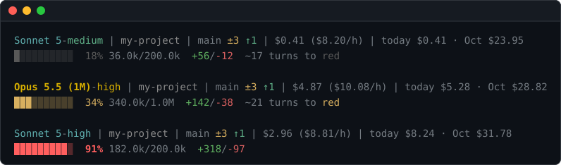

# claude-code-statusline

[](https://github.com/prasanna7401/claude-code-statusline/actions/workflows/ci.yml) [](LICENSE)

A status line for [Claude Code](https://claude.com/claude-code) that shows what you are spending, how full Claude's memory is, and how much of your plan's usage limit is left.



It runs locally, makes no network calls and sends nothing anywhere.

## What it shows

| Part | Example | Meaning |
|---|---|---|
| `model` | `Opus 5.5 (1M)-high` | Model, `(1M)` for the 1M-token window, effort level |
| `folder` | `my-project` | Working folder |
| `git` | `main ±4 ↑1 ↓2` | Branch, changed files, commits to push, commits to pull (as of last fetch) |
| `cost` | `$0.52 ($9.87/h)` | Session cost, cost per hour of Claude working |
| `spend` | `today $3.10 · Oct $41.20` | Spend today and this month; `⚠ N unpriced` if a model had no price |
| `context` | `░░░░░░░░░░   7% 67.1k/1.0M` | How full the context window (Claude's working memory) is |
| `churn` | `+142/-38` | Lines Claude added and removed this session |
| `forecast` | `~12 turns to red` | Turns left before the context bar turns red |
| `limits` | `5h █░░░░ 8% (18:40) · wk █░░░░ 2% (Thu)` | Plan usage in the 5-hour and weekly windows, with reset time |

A part with nothing to show is left out. Costs are Claude Code's own estimate at API list prices, not an invoice.

**Context bar colours.** Grey is fine, then amber, orange, red. Pricier models change colour sooner:

| Model | Amber | Orange | Red |
|---|---|---|---|
| Haiku | 50% | 75% | 90% |
| Sonnet, others | 40% | 65% | 85% |
| Opus | 25% | 50% | 75% |
| Fable | 20% | 40% | 65% |

Under 50k tokens left is at least orange; under 20k is red.

**Plan limits.** Shown only on a Pro or Max subscription, and only after Claude's first reply in a session. Bars are grey under 50%, yellow from 50%, orange from 75%, red from 90%. The reset shows as a time when it is under a day away, else as a weekday.

## Install

Needs bash 4.2+ and jq (see [Requirements](#requirements)). Then:

```bash
git clone https://github.com/prasanna7401/claude-code-statusline.git
cd claude-code-statusline
bash install.sh
```

In a terminal, the installer shows a menu: untick parts you do not want, and choose which line each part goes on. `bash install.sh --defaults` skips the menu and shows every part. The installer then points `settings.json` at the script (backup in `settings.json.bak`), runs the self-test and prints a preview. Restart Claude Code to see it.

To update, run `git pull` and `bash install.sh` again. Your layout and spend history are kept.

## Layout

The layout lives in `~/.claude/statusline.conf` (or `$CLAUDE_CONFIG_DIR/statusline.conf`). Each line lists part names in order:

```ini
line1=model folder git cost spend
line2=context churn forecast limits
```

A part on neither line is hidden. An empty `line2=` gives a single line. With no file, the layout above is used.

## Uninstall

```bash
bash install.sh --uninstall
```

This removes the `statusLine` setting, the script, `statusline.conf` and the data files. Restart Claude Code.

## Requirements

| System | Install |
|---|---|
| macOS | `brew install bash jq git`, then run the installer as `/opt/homebrew/bin/bash install.sh` (Intel: `/usr/local/bin/bash`) |
| Linux | `sudo apt install jq git` (Fedora: `sudo dnf install jq git`) |
| Windows | [Git for Windows](https://git-scm.com/download/win) (gives Git Bash), then `winget install jqlang.jq`; run the installer from Git Bash |

git is optional: without it the `git` part is hidden.

## Troubleshooting

| Problem | Fix |
|---|---|
| Nothing appears | Restart Claude Code, then run `bash ~/.claude/statusline.sh --selftest` |
| Bar always 0%, line 1 empty | jq not found: install it, then restart Claude Code (on Windows, open a new Git Bash) |
| Errors on macOS | Claude Code is using Apple's bash 3.2: rerun `/opt/homebrew/bin/bash install.sh` |
| Boxes instead of bars | Use a UTF-8 terminal; for the self-test, `export LC_ALL=C.UTF-8` |

How the script works (cost sources, files it writes, performance) is described in the header of [`statusline.sh`](statusline.sh).

## Contributing

See [CONTRIBUTING.md](CONTRIBUTING.md), and [SECURITY.md](SECURITY.md) for security reports.

## Licence

MIT. See [LICENSE](LICENSE).
